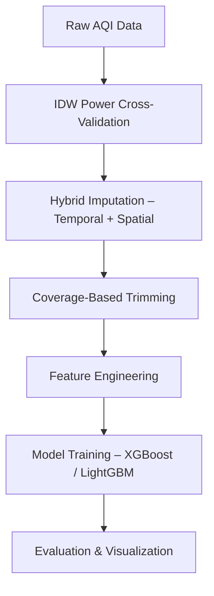

#  **Delhi AQI Index Prediction**  

### 🧠 **Spatio-Temporal Air Quality Forecasting using Machine Learning**

> *📍 A research-grade, leakage-safe spatio-temporal forecasting pipeline for predicting major air pollutants across Delhi using tree-based machine learning models.*

---

## **Why This Project?**   
Air quality data is hard — not because of models, but because of **data reality**:

- ❌ Severe missingness
- 📍 Sparse spatial coverage
- ⏱️ Strong temporal dependencies

This project tackles **all three simultaneously**, end-to-end, with methodological rigor.

---

## **Key Capabilities**    

- ✅ Hybrid **temporal + spatial imputation**
- ✅ Leakage-safe **time-aware validation**
- ✅ Per-pollutant forecasting (6 pollutants)
- ✅ City-wide **7-day hourly AQI heatmaps**
- ✅ XGBoost vs LightGBM comparison
- ✅ Interpretability via feature importance & time-series plots

---

## 🗂️ **Dataset Snapshot**

📍 **Location**: Delhi, India  
🏭 **Stations**: 40 monitoring stations  
⏳ **Time Span**: 2009 – 2023  
⏱️ **Resolution**: Hourly  

### 🌬️ **Pollutants Modeled**
- PM2.5
- PM10
- NOx
- SO₂
- CO
- O₃

---

## 🧠 **Core Modules Overview**

| Module | Description |
|------|------------|
| 🧩 Data Ingestion | Validates raw AQI data and station metadata |
| 🛠️ Gap Analysis | Classifies missing segments by duration |
| 🧪 IDW Tuning | Cross-validates IDW power per pollutant |
| 🔄 Imputation Engine | Hybrid temporal + spatial gap filling |
| 🧮 Feature Engineering | Time, lag, rolling, and spatial features |
| 🤖 Model Training | XGBoost & LightGBM per pollutant |
| 📊 Evaluation | Leakage-safe temporal validation |
| 🌍 Visualization | City-wide heatmaps & station time-series |

---

## 🔧 **End-to-End Pipeline**

---

## 🧩 **Hybrid Imputation Strategy**

Missing values are handled **per pollutant, per station**, based on gap length:

| Gap Length | Method |
|----------|--------|
| ≤ 6 hours | Linear interpolation |
| ≤ 72 hours | Kalman smoothing |
| > 72 hours | Spatial IDW |

🌐**Long gaps are reconstructed using **Inverse Distance Weighting (IDW)** from neighboring stations.**

---

## 🔍 **IDW Power Optimization**

IDW power parameter **p ∈ [0.2, 2.0]** tuned using cross-validated RMSE.

| Pollutant | Optimal p |
|---------|-----------|
| PM2.5 | 0.20 |
| PM10 | 0.20 |
| NOx | 0.20 |
| SO₂ | 0.20 |
| CO | 0.29 |
| O₃ | 0.46 |

📌 **Low values indicate strong regional spatial coherence.**

---

## 🛠️ **Feature Engineering**

### ⏱️ **Temporal Features**
- Hour of day
- Day of week
- Month
- Season

### 🔁 **Lag & Rolling Features**
- Lags: 1h, 24h, 48h, 72h
- Rolling means: 24h, 72h

### 🌍 **Spatial Features**
- Latitude
- Longitude
- Station ID (categorical)

📊 **Final Dataset**
- ~1.75 million rows  
- 42 engineered features  

---

## 🤖 **Model Training**

### 🧠 **Models Used**
*- XGBoost*
*- LightGBM*

### 🧪 **Validation Strategy**
- Last **60 days** used as test set
- Training data strictly precedes test data
- Zero temporal leakage

This mirrors **real-world forecasting**, not offline curve fitting.

---

## 📊 **Model Performance (LightGBM)**

| Pollutant | RMSE | MAE |
|---------|------|-----|
| PM2.5 | 22.07 | 13.15 |
| PM10 | 39.84 | 25.34 |
| NOx | 22.66 | 11.81 |
| SO₂ | 3.66 | 1.87 |
| CO | 0.43 | 0.20 |
| O₃ | 8.73 | 4.72 |

🏆 **LightGBM consistently outperformed XGBoost slightly.**

---

## 📈 **Model Interpretation**

Key insights from feature importance analysis:

- 🧠 Lagged pollutant values dominate predictions
- 🌞 Strong diurnal and seasonal cycles
- 📍 Spatial features distinguish station behavior

📂 Stored in:
>*results/feature_importance/*

---

## 🌍 **Spatial Forecasting & Heatmaps**

- 🕒 Hourly forecasts for **7 days**
- 🗺️ City-wide interpolation using IDW
- 🌫️ High-resolution AQI heatmaps

📂 Available in:
>*results/heatmaps/*

---

## 🧪 **Time-Series Validation**

Station-level validation confirms temporal consistency:

- 📉 **Actual vs predicted plots**
- 🏭 Example stations: **Station 5**, **Station 33**

📂 Available in:
>*results/accuracy_plots/*

---

## 🚀 **Final Note**

This project prioritizes **methodological correctness, leakage prevention, and real-world reliability** over shortcuts and leaderboard metrics.
